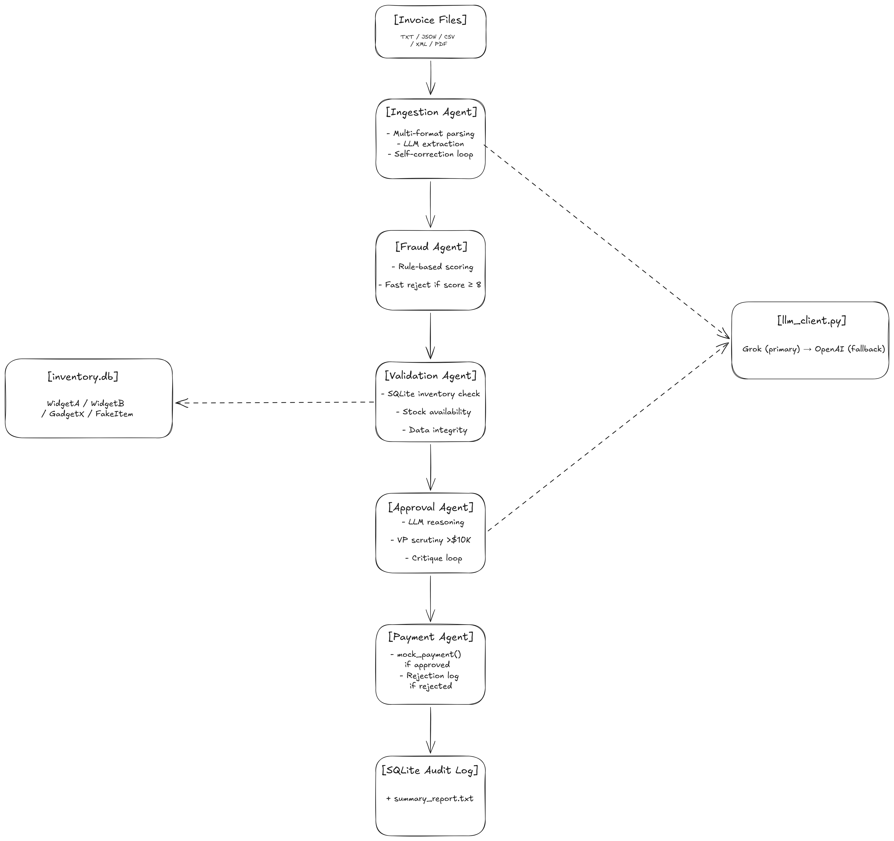

# Galatiq Invoice Processing System

A multi-agent invoice processing pipeline built with LangGraph, OpenAI GPT-4o and xAI Grok.
Automates end-to-end AP workflows for Acme Corp — ingestion, fraud detection, validation, approval and payment.

## Architecture

```
Invoice File (TXT / JSON / CSV / XML / PDF)
        ↓
 [Ingestion Agent]    Multi-format parsing + LLM extraction + self-correction loop
        ↓
 [Fraud Agent]        Rule-based fraud scoring — fast rejects high risk invoices before LLM processing
        ↓
 [Validation Agent]   SQLite inventory checks — stock availability, unknown items, data integrity
        ↓
 [Approval Agent]     LLM reasoning + VP scrutiny (>$10K) + critique reflection loop
        ↓
 [Payment Agent]      mock_payment() if approved — structured rejection log if rejected
        ↓
  SQLite Audit Log + summary_report.txt

```


## Setup

```bash
# 1. Install dependencies
pip install -r requirements.txt

# 2. Initialize the inventory database
python setup_db.py

# 3. Configure API keys in .env
OPENAI_API_KEY=sk-...
GROK_API_KEY=xai-...   # optional - system falls back to OpenAI if not set
```

## Usage

```bash
# Process a single invoice
python main.py --invoice_path=data/invoices/invoice_1001.txt

# Process all invoices and generate summary report
python main.py --run_all
```

## Test Scenarios

| Invoice | Format | Scenario | Expected Outcome |
|---|---|---|---|
| invoice_1001.txt | TXT | Clean order within stock | Paid |
| invoice_1002.txt | TXT | GadgetX x20, only 5 in stock | Stock exceeded, rejected |
| invoice_1003.txt | TXT | FakeItem, urgency language, wire transfer | Fraud detected, fast rejected |
| invoice_1004.json | JSON | Clean JSON with nested vendor | Paid |
| invoice_1004_revised.json | JSON | Revised invoice, same number | Processed as revision, paid |
| invoice_1005.json | JSON | GadgetX x8 exceeds stock | Stock exceeded, rejected |
| invoice_1006.csv | CSV | Vertical key-value CSV format | Paid |
| invoice_1007.csv | CSV | Horizontal tabular CSV, high value | Stock exceeded, rejected |
| invoice_1008.txt | TXT | Unknown items SuperGizmo, MegaSprocket | Unknown items, rejected |
| invoice_1009.json | JSON | Negative quantity, missing vendor | Hard rejected |
| invoice_1010.txt | TXT | Duplicate item lines same product | Quantities summed, paid |
| invoice_1011.pdf | PDF | PDF extraction | Paid |
| invoice_1012.txt | TXT | Messy layout, typos, OCR-style | Paid |
| invoice_1013.json | JSON | Same item across multiple lines | Quantities summed, all exceeded, rejected |
| invoice_1014.xml | XML | XML format, EUR currency | Paid |
| invoice_1015.csv | CSV | Tabular CSV clean order | Paid |
| invoice_1016.json | JSON | WidgetC not in inventory | Unknown item, rejected |

## Agents

### Ingestion Agent
- Handles TXT, JSON, CSV (two formats), XML, PDF
- Normalizes item names: `Widget A` -> `WidgetA`, `Gadget X` -> `GadgetX`
- Normalizes invoice numbers: `1002` -> `INV-1002`
- Extracts nested vendor fields from JSON
- Self-correction loop: if confidence < 0.75 runs a critique pass

### Fraud Agent
- Pre-validation gate, runs before any expensive LLM processing
- Scores invoices 0-10 across 6 signal types: urgency language, suspicious vendor name, email origin, missing fields, round amounts, missing due date
- Fast rejects if score >= 8, saving validation and approval cost
- INV-1003 scores 9.5 and is rejected before hitting validation

### Validation Agent
- Pure Python, no LLM — fast, deterministic, auditable
- Sums quantities per item across all line items before checking stock
- Flags: UNKNOWN_ITEM, OUT_OF_STOCK, STOCK_EXCEEDED, INVALID_QUANTITY

### Approval Agent
- LLM reasoning with invoice aging context injected into prompt
- Invoices > $10K flagged for elevated VP scrutiny
- Self-critique loop: second compliance officer pass reviews the decision
- Hard reject fast path for INVALID_QUANTITY bypasses LLM entirely

### Payment Agent
- Approved: calls mock_payment(), generates TXN ID, logs to SQLite
- Rejected: logs structured rejection with reasoning and flags

## Above and Beyond

- **Fraud scoring agent** — dedicated pre-filter agent with 6 signal types
- **Multi-LLM support** — Grok primary, OpenAI fallback, logged per invoice
- **Invoice aging** — due date urgency injected into approval reasoning
- **Duplicate detection** — checks audit log before processing, respects revised invoices
- **Confidence scoring** — extraction confidence shown per invoice
- **Batch summary report** — full run results saved to summary_report.txt

## LLM Strategy

The system uses a unified `llm_client.py` that tries Grok first if `GROK_API_KEY` is set, automatically falling back to OpenAI if unavailable. The LLM used is logged per agent per invoice. Both Grok and OpenAI use the same chat completions interface making the switch seamless.
